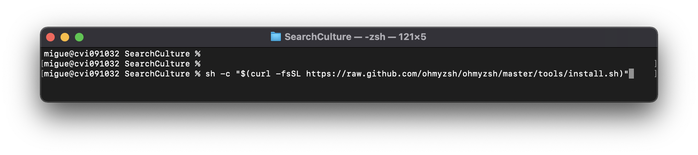
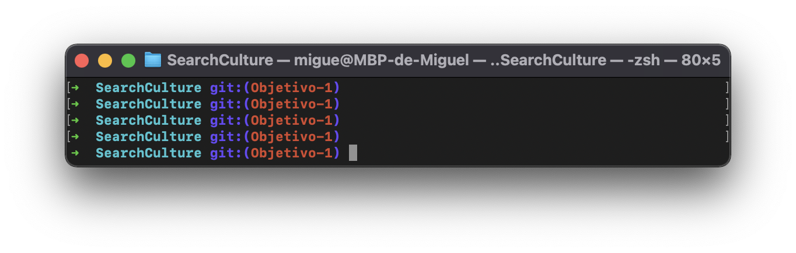
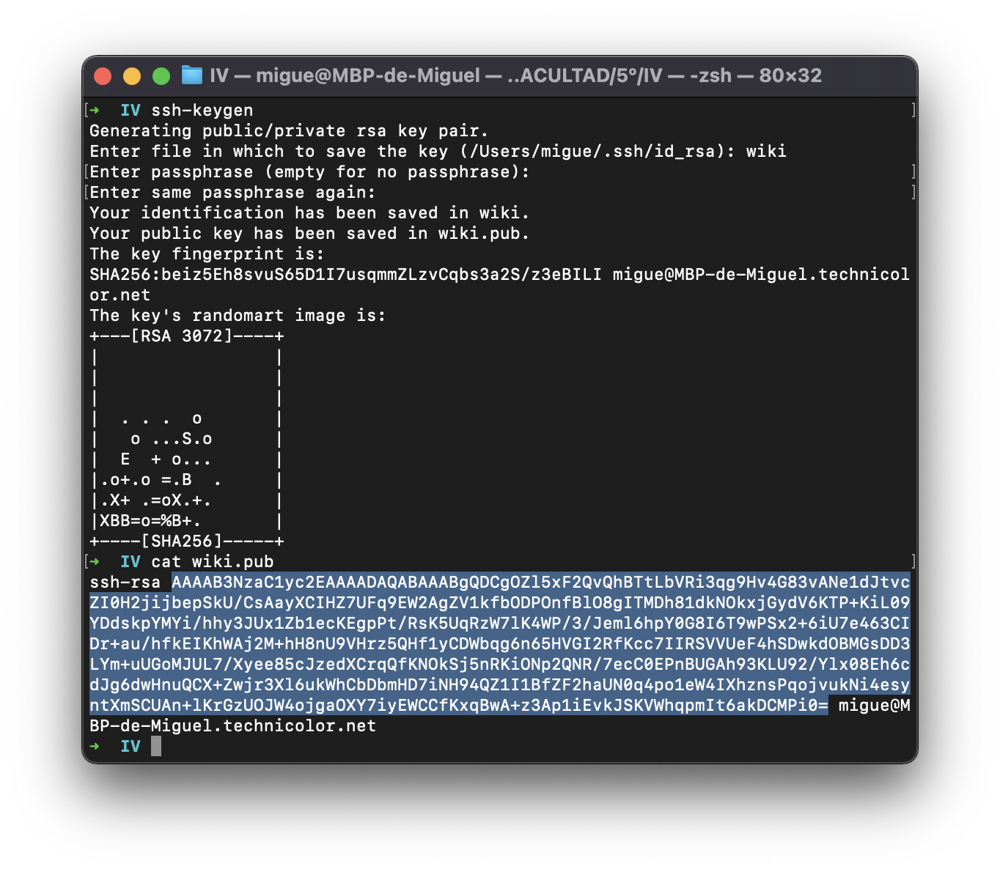

# Tutoriales

## 1. Como instalar "oh my zsh"

"oh my zsh" es un pack de utilidades para zsh que hará la terminal más vistisa y amigable, incluyendo entre otros, colores, temas, atajos, ayudas, etc. 

1. Introducimos el comando: 
> sh -c "$(curl -fsSL https://raw.github.com/ohmyzsh/ohmyzsh/master/tools/install.sh)"

2. Tras esto, una vez acabe, abrimos una nueva terminal, y nos saldrá de la siguiente forma:

## 2. Como configurar el par de claves para GitHub

1. Ejecutamos 
> ssh-keygen
2. Establecemos nombre y contraseña para la clave (opcional)
3. Obtener la key para introducirla en GitHub
   
__La key de la imagen se ha creado únicamente para el ejemplo, tras la captura ha sido borrada, por eso no está censurada__

4. A continuación entramos en settings dentro del perfil de GitHub, y añadimos la clave:

   